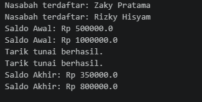

# Tugas-PBO-Array dan ArrayList -Sistem Bank

## Daftar File (Source Code)
*   `Account.java`: Kelas untuk mengelola saldo serta logika transaksi setor `deposit` dan tarik tunai `withdraw`.
*   `Customer.java`: Kelas penyimpan data identitas nasabah dan daftar rekening yang dimiliki (maksimal 5 rekening).
*   `Bank.java`: Kelas pengelola daftar seluruh nasabah di dalam sistem bank.
*   `Main.java`: Kelas utama untuk menjalankan skenario pendaftaran nasabah dan uji coba transaksi.

## 📸 Screenshot Eksekusi Program
